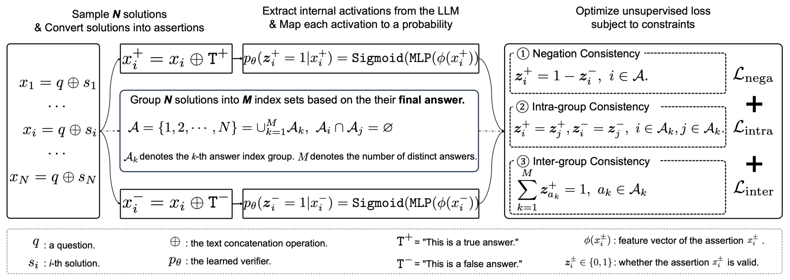

# llm_lover

This project is the implementation of [**Logic-Regularized Verifier Elicits Reasoning from LLMs**](https://aclanthology.org/2025.acl-long.1567/).



NOTE: The project is still a work in progress—for instance, the feature generation code is not yet included. We are actively refining the codebase and enhancing the project. 

## feature (hidden states from LLMs)

The feature has a shape of (num_data, N, 2, d, num_layers), where:

- num_data: Number of data samples
- N: Sampling count
- 2: Two contrastive assertions
- d: Feature dimension
- num_layers: Number of LLM layers

We provide some feature data ([**Google Drive**](https://drive.google.com/drive/folders/1h-C7RgEC4raoanUxSmCeV598OBAKBNve?usp=sharing)) for running the code.  

The feature data is based on **GSM8K** and **Mistral-7B-Instruct-v0.3**.  We randomly selected **1,500 samples** from the GSM8K training set and the full **1,319 samples** from the test set. Only the **last-layer features** were extracted.  

## train & test
```shell
sh train.sh
```

## Acknowledge 

CCS: https://github.com/collin-burns/discovering_latent_knowledge

CoT-Decoding: https://github.com/shirley-wu/cot_decoding

MATH: https://github.com/hendrycks/math

## Cite

```
@inproceedings{wang2025logic,
  title={Logic-Regularized Verifier Elicits Reasoning from LLMs},
  author={Wang, Xinyu and Sun, Changzhi and Cheng, Lian and Wu, Yuanbin and Zhang, Dell and Wang, Xiaoling and Li, Xuelong},
  booktitle={Proceedings of the 63rd Annual Meeting of the Association for Computational Linguistics (Volume 1: Long Papers)},
  pages={32617--32630},
  year={2025}
}
```
